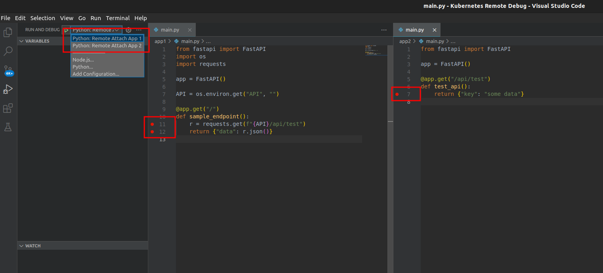
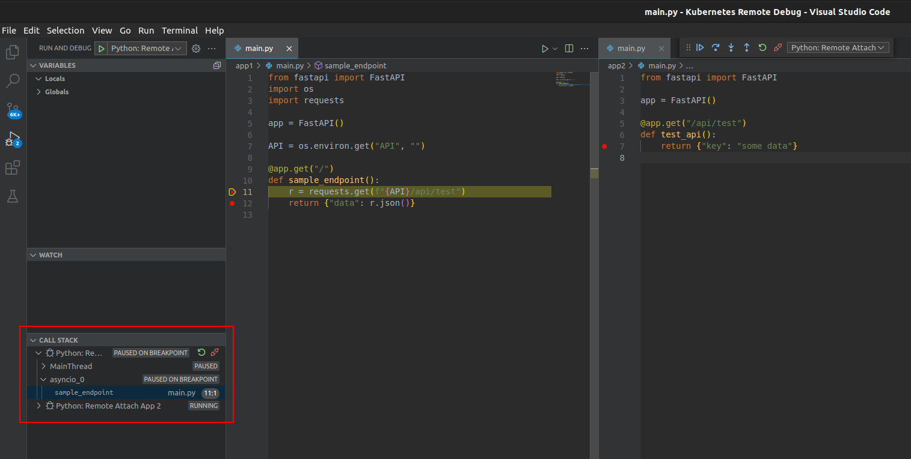

# Remote Debugging Python Applications Runnning on Kubernetes

Setup for remote and interactive debugging of Python application running in Kubernetes.

Works with VS Code debugger. Can be used to debug multiple containers/pods at the same time

Repository includes two sample applications (`app1` and `app2` directories) and debug configuration for VS Code.

Accompanying article:

- [TODO](TODO)

----------

## Setup

Create cluster:

```shell
minikube start --kubernetes-version=v1.26.3
```

Build and deploy applications:

```shell
docker build -f app1/Dockerfile -t docker.io/martinheinz/python-debugging-app1:v1.0 app1
docker build -f app2/Dockerfile -t docker.io/martinheinz/python-debugging-app2:v1.0 app2

minikube image load docker.io/martinheinz/python-debugging-app1:v1.0
minikube image load docker.io/martinheinz/python-debugging-app2:v1.0

# ... or docker push ...

kubectl apply -f deployment.yaml
```

Build debugger image:

```shell
docker build -f debugger.Dockerfile -t docker.io/martinheinz/python-debugger:v1.0 .
minikube image load docker.io/martinheinz/python-debugger:v1.0
```

To debug:

1. Inject the ephemeral container into application Pods:

```shell
# Deployment patch
APP1_POD=$(kubectl get -l=app=app1 pod --output=jsonpath='{.items[0].metadata.name}')
APP2_POD=$(kubectl get -l=app=app2 pod --output=jsonpath='{.items[0].metadata.name}')
./create-debug-container.sh default "$APP1_POD" app1
./create-debug-container.sh default "$APP2_POD" app2
```

2. Forward application and debugger traffic to local:

```shell
kubectl port-forward "$APP1_POD" 5000 5678 &
kubectl port-forward "$APP2_POD" 5679:5678 &
```

3. Add breakpoints to your code
4. Launch debugger(s)



5. Query application API (`curl localhost:5000`)


